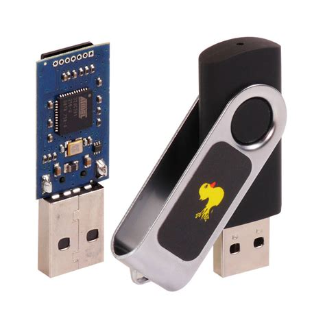

# Rubber Ducky Password Stealer

This software enables you to retrieve user passwords from a Windows 10/11 system, including passwords from browsers, installed programs, and system-stored passwords such as Wi-Fi passwords. Additionally, there is an optional feature to add scripts for retrieving system information, program information, network information, etc. You can also add your own `.bat` scripts that are automatically executed alongside the existing scripts.

The retrieved data is stored in text files on the SD card of the Rubber Ducky. This data is organized in a folder named after the target's computer and username, ensuring no complications when running on multiple computers or user accounts.

The Twin Duck firmware, custom payload, custom scripts, and third-party programs make this possible. Special thanks to the external contributors mentioned on this GitHub page, who play an essential role in this software.

> Disclaimer: I am not responsible for any damage caused by this software to your own or other systems. The purpose of this software is to recover forgotten passwords, improve your own digital security, and gain knowledge about Rubber Ducky, the Twin Duck firmware, writing scripts, and using external programs. It is not intended for malicious purposes.

## Requirements

- Rubber Ducky with the [The Twin Duck firmware](./assets/c_duck_v2.1.hex) (c_duck_v2.1.hex) installed ([Official Rubber Ducky firmware](./assets/duck_v2.1.hex) (duck_v2.1.hex) for backup).
- Micro SD card (Note: The default 128mb micro SD card did not work in my case).

## Compatibility

- Windows 10/11 x32/x64.
- Windows Security must be used as virus scanner for this software to work.
- Successful operation on the target system depends on the language support of the payload.
- This software can only be executed if the user has unlocked their system.
- This software (unchanged) only works on systems that are not too slow to perform the slow payload version and the external software within a certain time.

## Setup Rubber Ducky environment

1. Rename the label of the Rubber Ducky storage to: `RDPS`.
2. Download the [latest release](https://github.com/Krouwndouwn/Rubber_Ducky_Password_Stealer/releases/latest)
(environment and scripts, payload with the correct language (a payload equal to the target system) and extra scripts for system information (optional)), and extract the `.rar` files to the root location of the Rubber Ducky storage.
3. Disable Windows Security; otherwise, the downloaded files will be removed in the next steps.
4. Download the [Windows Password Recovery Tools](https://www.nirsoft.net/password_recovery_tools.html) with command-line support from Nirsoft and extract them to: `(Rubber Ducky storage)\files\nirsoft\`.
5. Manualy download the command-line tools: BulletsPassView, OperaPassView, RouterPassView and WirelessKeyView from the [Nirsoft](https://www.nirsoft.net/) website and extract the downloaded x32 files (only the `.exe` files) to: `(Rubber Ducky storage)\files\nirsoft\`.
6. Rename the downloaded x64 files to: `(filename)_x64.exe` and move them to: `(Rubber Ducky storage)\files\nirsoft\`. Also, do this for the x64 files located in: `(Rubber Ducky storage)\files\nirsoft\x64\` and remove the x64 folder afterwards. Feel free to delete Nirsoft files that are of no use to you. Learn more about what these files do on the [Nirsoft](https://www.nirsoft.net/) website.
7. Rename all extrensions of the files located in: `(Rubber Ducky storage)\files\nirsoft\` from: `.exe` to: `.rdps`. This helps reduce Windows Security's alertness to these files when the Rubber Ducky is plugged into the target system.
8. Download the [mimikatz](https://github.com/gentilkiwi/mimikatz/releases) tool and extract it to: `(Rubber Ducky storage)\files\mimikatz\`.
9. Rename the extension of the `mimikatz.exe` files located in: `(Rubber Ducky storage)\files\mimikatz\Win32\` and `(Rubber Ducky storage)\files\mimikatz\x64\` from: `.exe` to: `.rdps`.
10. Safely remove the Rubber ducky storage.
11. Turn Windows Security back on.
12. The Rubber Ducky environment is now fully set up and ready for use.

> Note: Regularly update this software and the external programs mentioned above for optimal results.

## Usage

1. Ensure the Rubber Ducky environment is set up correctly.
2. Insert the Rubber Ducky into the target system.
3. Wait about 60 seconds until everything is executed. If a Caps Lock light is present, it will flash several times to indicate completion.
4. Remove the Rubber Ducky from the target system.
5. If all went well, the Rubber Ducky has saved the results in the result folder.

## Customize and Optimize

**Optimize speed**

- Remove unnecessary executable programs (Nirsoft and/or mimikatz) and scripts that increase execution time.
- Adjust the "Wait Until Everything is Executed" time in the payload to match the time required for all programs and scripts to run.
- Reduce the waiting times (`DELAY`) in the payload where possible to execute faster on the target system. This depends on the speed of the target system.

**Add Programs and Scripts**

- Add your own `.bat` scripts to be automatically executed by placing them in the: `(Rubber Ducky storage)\files\scripts\` folder.
- Add your programs in the: `(Rubber Ducky storage)\files\(new folder)\` folder, which can be controlled by their own `.bat` script.

**Change Virus Scanner**

- Modify the payload script to disable a different virus scanner. It may be possible to disable another virus scanner by adding scripts or executable programs.

**Customize Everything**

- Rewrite or reuse the payload and scripts to develop new software with different goals, such as automating installations or changing Windows settings automatically.

## Issues

Please feel free to [submit an issue](https://github.com/Krouwndouwn/Rubber_Ducky_Password_Stealer/issues/new/choose) for:

- Reporting a bug.
- Reporting a grammatical error.
- Suggesting a feature.
- Suggesting an improvement.
- Any other issue with the payloads, scripts, or GitHub page.

## FAQ

**How can i rename file extensions?**

Open Windows file explorer, open the `View` tab, click on `View` and enable: `Hidden items`. Then replace the extension name.

**How do I generate my own payload?**

Create a payload on the [Payload Studio](https://payloadstudio.hak5.org/community/) website.
